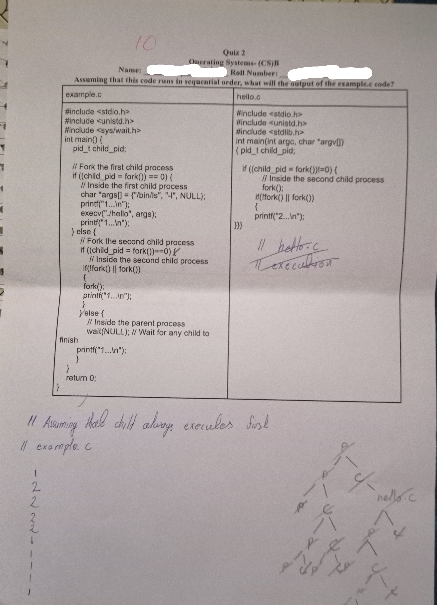

#include <unistd.h>
int main(int ane char “arov)
pid_t child_pid; { pid_t ch

// Fork the first child process if ((child_pid = fork())!=0) {
if ((child_pid = fork()) == 0) {
// Inside the first child process iy
char “args[] = {"/bin/Is", "-I", NULL}; neon || fork())
printf("1...\n"); {
execv("./hello", args); printf("2...\n");
printf("1...\n"); ))
} else {
// Fork the second child process
if ((child_pid = fork())==0) /
// Inside the second child process

: eas ll ee

fork();
printf("1 An");

}
Yelse {
// Inside the parent process
wait(NULL); // Wait for any child to
finish
printf("1...\n");
}

}

return 0;

}

1/ Asuming Al! cif aden
If exa rnp e.

\
-
2

