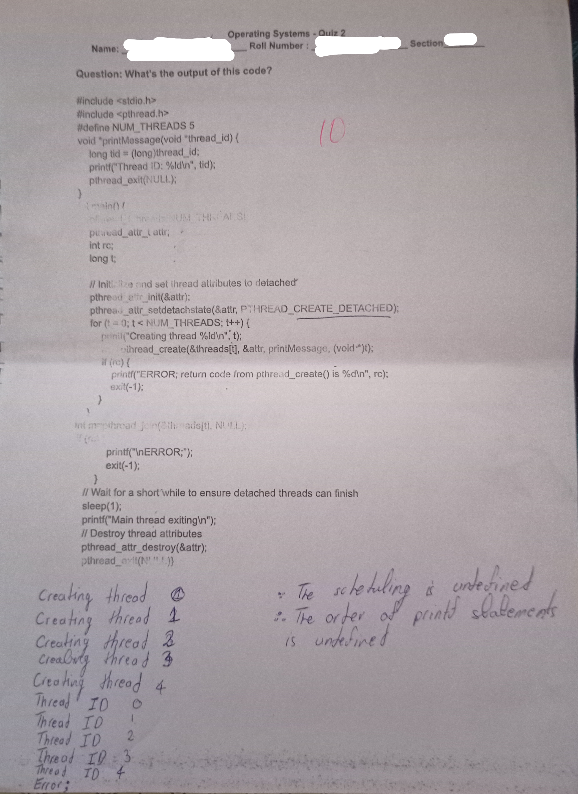

plwead_atir_(attr;
int re;
tong t;

WAniti. ve ond set ihread atiributes to detached’

pthread er_init(&attr);

pthrea._attr_setdetachstate(&attr, PT HREAD_CREATE_DETACHED);
for (t = 0; t< NUM_THREADS; t++) {

—_—————

_ penii(’Creating thread %ld\n at;
_ »thread_create(&threads|t], &attr, printMessage, (void*)t);

if (re) {
printi("ERROR; return code from pthread_create() i is %d\n", rc);
exit(-1); ;

oad j Sthreads|t], NULL:

printf("\nERROR;’);
exit(-1);
}

// Wait for a short‘while to ensure detached threads can finish
sleep(1);
printf("Main thread es,

