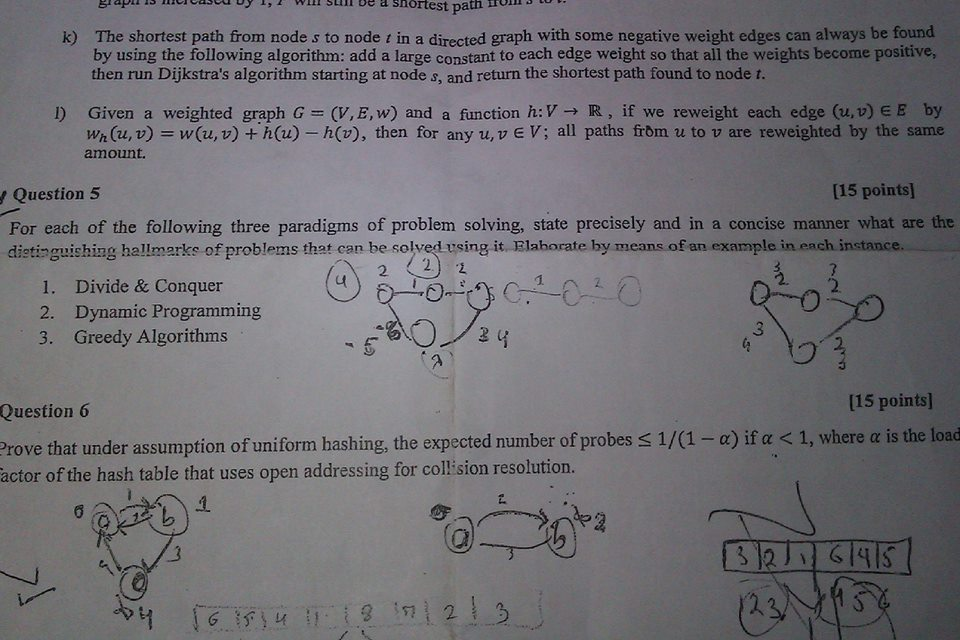

a SR a al a eel ti 8 re pe

k) The shortest path from node s to node ¢ in a directed graph with some
by using the following algorithm: add a large constant to each edge w
then run Dijkstra's algorithm starting at node s, and return the shortest

1) Given a weighted graph G = (V,E,w) and a function h:V > R, if we
Wye, v) = w(u,v) + h(u) — h(v), then for any u,v €V; all paths fm:
amount.

¢ Question 5

z Pi
For each of the following three paradigms of problem solving, state precisely and in <
distinguishing hallmarks of problems that can be solved using it Blaborate by mean

1, Divide & Conquer (ye call)
2. Dynamic Programming
' 3. Greedy Algorithms ac
Question 6

>rove that under assumption of uniform hashing, the expected number of probes < 1/(1 —

actor of the hash table that uses open addressing for collision resolution.
1 2

ie

