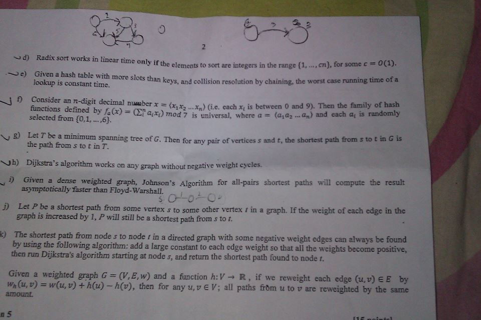

2
linear tte only tree temo wo sor are inegen in the rmge (1,1, ee
‘ore slots than keys, and collision resolution by chaining, the worst case running time of &

22) Givena hash table with m
Jookup is constant time.
~J 9 Consider an n-digit decimal number x = (x,y. an%q) (Ge. each x; is between 0 and 9). Then the family of hash
iietions defined by /a(x) = (E¥a,x,) mod is universe, where a= (axa --Gq) and each ai randomly

selected from {0,1,
Ny 2) Let P be a minimum spanning
the path from s to ¢ in 7.
~Jh) Dijkstra’s algorithm works on any graph without negative weight eyeles.
. 9) Given a dense weighted graph, Jobnson’s Algorithm for all-pairs shortest paths will compute the result
5 to some other vertex ¢ in a graph. If the weight of each edge in the

tree of G. Then for any pair of vertices s and f, the shortest path fromstotimGis
s aa

asymptotically faster than Floyd-Warshall. __,
$O--6
D Let P be a shortest path from some vertex
graph is increased by 1, P will still be a shortest path from s to f.
directed graph with some negative weight edges can elways be found
¢ constant to each edge weight so that all the weights become positive,

k) The shortest path from node s to node 1 in a
by using the following algorithm: add a larg
then run Dijkstra's algorithm starting at node s, and retum the shortest path found to node 1,
if we reweight each edge (uv) EE by
then for any u,v €V; all paths frdm u to v are reweighted by the same

Given a weighted graph G = (V,E,w) and a function h:V > R,
4 (u,v) = w(u,v) + h(u) — AC),

nS
