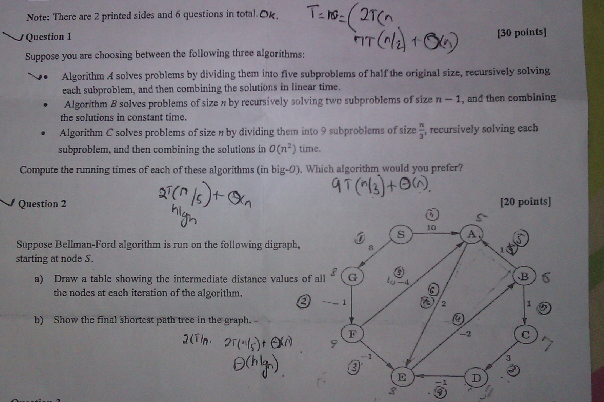

Note: There are 2 printed sides and 6 questions in total. Ox, l- e~ 2T(n oe
y Question 1 ar(o la t Xn) agian ie

Suppose you are choosing between the following three algorithms:

se Algorithm 4 solves problems by dividing them into five subproblems of half the original size, recursively solving,
each subproblem, and then combining the solutions in linear time.
e Algorithm B solves problems of size n by recursi\ vely solving two subprob
the solutions in constant time.
© Algorithm C solves problems of size n by dividing them into 9 subproblems of size _ recursively solving each

lems of size n — 1, and then combining —

subproblem, and then combining the solutions in O(n*) time

Compute the rmning times of each of these algorithms (in big-O). W A algorithm would Gy) prefer?
AT (*(3 4)+ 4 An

ifn at
= J Miection 2 2 s % SX, [20 points}

Suppose Bellman-Ford algorithm is run on the following digraph,
starting at node S.

a) Drawa table showing the intermediate distance values of all :
the nodes at each iteration of the algorithm. G6
See |

~ ») Show the final shortest path tree in the graph. -
2m ar(nfc)+ KA ?

oth)

ae <a «See,
