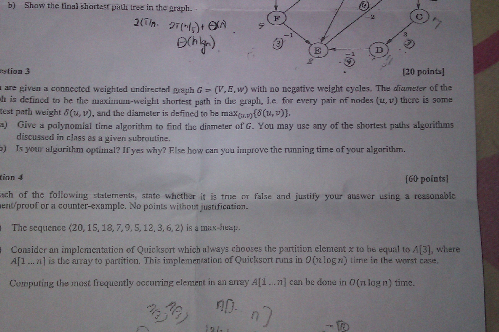

b) Show the final Shortest path tree in the graph. - : acai

(Tp. T(n[)t A es
Ohl) oe
wot

estion 3

| are given a connected weighted undirected graph G = (V,£,w) with no negative weight cycles. The di

ih is defined to be the maximum-weight shortest path in the graph, ie. for every pair of nodes (u,v) u

test path weight 6(u, v), and the diameter is defined to be maXiy,7){6(u, v)}-

a) Give a polynomial time algorithm to find the diameter of G. You may use any of the shortest paths
discussed in class as a given subroutine.

9) Is your algorithm optimal? If yes why? Else how can you improve the running time of your algorithm. —

tion 4

ent/proof or a counter-example. No points without amananet Me ise
) The sequence (20, 15, 18, 7,9,5, 12,3, 6,2) is a max-heap.

) Consider an implementation of Quicksort which always chooses the partition element x to bee a
A[1 ...n] is the array to partition. This implementation of Quicksort runs in O(n log7) time in the
