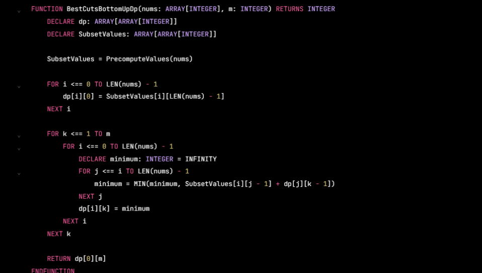

FUNCTION BestCutsBottomUpDp(nums: ARRAY[INTEGER], m: INTEGER) RETURNS INTEGER
DECLARE dp: ARRAY[ARRAY[INTEGER]]
DECLARE SubsetValues: ARRAY[ARRAY[INTEGER]]

SubsetValues = PrecomputeValues(nums)

FOR i <== @ TO LEN(nums) - 1

dp[i][6] = SubsetValves[i][LEN(nums) - 1]
NEXT 4
FOR k <== 170m

FOR i <== @ TO LEN(nums) - 1
DECLARE minimum: INTEGER = INFINITY

FOR j <s= i TO LEN(nums) - 1
minimum = MIN(minimum, SubsetValues[i][j - 1] + dplj][k - 1])
NEXT j
dpli][k] = minimum
NEXT 4

NEXT k

RETURN dp[O] [m]
EMNEUNCTTON
