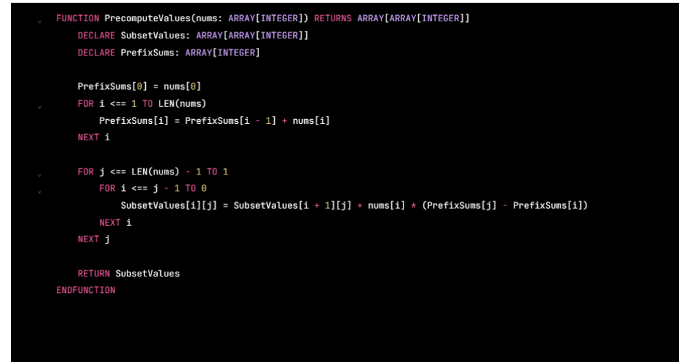

FUNCTION PrecomputeValues(nums: ARRAY[INTEGER]) RETURNS ARRAY[ARRAYLINTEGER]]
DECLARE SubsetValues: ARRAY[ARRAY[INTEGER]]
DECLARE PrefixSums: ARRAY[INTEGER]

PrefixSums[6] = nums[@]

FoR i <== 1 TO LEN(nums)
PrefixSums[i] = PrefixSums[i - 1] + nums[i]
NEXT i
FOR j <== LEN(nums) - 1 TO 1
FORi<e=j-1700
SubsetValues[i][j] = SubsetValues[i + 1][J] + nums[i] + (PrefixSums[j] - PrefixSums[i])
NEXT 4
NEXT j

RETURN SubsetValues
ENDFUNCTION
